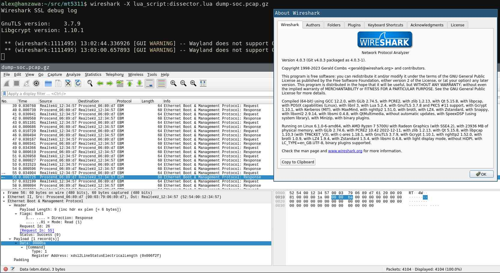

Utilities for working with Metanoia/Proscend VDSL2 SFP Modems.

## Related Links

 * VDSL2 SFP Modem:
    * [Metanoia MT-V5311](https://web.archive.org/web/20220524112417/https://metanoia-comm.com/products/xdsl/vdsl2-sfp/) - seems to be the OEM
    * [Proscend 180-T](https://www.proscend.com/en/product/VDSL2-SFP-Modem-Telco/180-T.html)
    * [ALLNET ALL4781-VDSL2-SFP](https://www.allnet.de/en/allnet-brand/produkte/modems-router/sfp-vdsl2-bridge-modem)
 * Useful non-official public materials regarding the modem:
    * [Proscend SOS/ROC Firmware Update](https://youtu.be/fdCl3nxgEyA)
    * Duxtel:
       * [PS180-T - recommended applications and limitations](https://shop.duxtel.com.au/help/en-gb/11-product-advisory/38-ps180-t-recommended-applications-and-limitations)
       * [Notice regarding upcoming SOS/ROC problems](https://www.facebook.com/duxtel/posts/if-you-use-proscend-ps180-t-vdsl-modem-on-nbn-services-you-may-already-be-aware-/1907876142708182/)
    * Forums:
       * [User experience - ALLNET ALL4781-VDSL2-SFP / Switch Modul (Mini-GBIC), VDSL2](https://forum.turris.cz/t/user-experience-allnet-all4781-vdsl2-sfp-switch-modul-mini-gbic-vdsl2/)
       * [Proscend 180-t vdsl2 SFP Support](https://forum.netgate.com/topic/165393/proscend-180-t-vdsl2-sfp-support/)
    * [Dumping the EEPROM](https://github.com/TheSkorm/Proscend--180-T/wiki)

# Utilities

I have used Lua (compatible with version 5.1) in the hope this work may be found to be useful to the OpenWRT community, a group that benefits from software with low disk space usage dependencies.

To set up your OS to run any of the utilities below, run:

 * **Debian (and probably Ubuntu):**

       sudo apt install --no-install-recommends lua5.1 luarocks

   Now depending on:

    * If your distro provides [`lua-posix` 35.1 or later (for `AF_PACKET` support)](https://github.com/luaposix/luaposix/releases/tag/v35.1), then run:

          sudo apt install --no-install-recommends lua-posix

    * Otherwise, run:

          sudo apt install --no-install-recommends build-essential liblua5.1-dev
          sudo luarocks install luaposix

 * **OpenWRT:**

       opkg install lua lua-posix luarocks

Now run:

    luarocks install lua-struct		# (*with* hyphen)

Now fetch the project using:

    git clone https://github.com/jimdigriz/mt5311.git /opt/mt5311

## EBM Read

A one shot utility to query the SFP for information.

To use it, run as `root`:

    # lua /opt/mt5311/ebm-read.lua eth1 00:03:79:06:89:d7 xdsl2LineStatusAttainableRateUs xdsl2LineStatusAttainableRateDs xdsl2LineStatusElectricalLength
    reg	hex	int
    xdsl2LineStatusAttainableRateUs	001a25	6693
    xdsl2LineStatusAttainableRateDs	00af60	44896
    xdsl2LineStatusElectricalLength	0000b8	184

The output is in TSV (tab separated variable) format.

You should look at the [`register.map`](./register.map) file for other registers that you can read, but as well as the names you can provide the register address (integer or hexidecimal) directly.

## SNMP

**N.B.** WORK IN PROGRESS AND NOT COMPLETE

An [AgentX subagent](https://datatracker.ietf.org/doc/html/rfc2741) that where possible implements the following MIBs:

 * [RFC 5650](https://datatracker.ietf.org/doc/html/rfc5650) - Definitions of Managed Objects for Very High Speed Digital Subscriber Line 2 (VDSL2)
    * [RFC 3728](https://datatracker.ietf.org/doc/html/rfc3728) - Definitions of Managed Objects for Very High Speed Digital Subscriber Lines (VDSL)
    * [RFC 4070](https://datatracker.ietf.org/doc/html/rfc4070) - Definitions of Managed Object Extensions for Very High Speed Digital Subscriber Lines (VDSL) Using Multiple Carrier Modulation (MCM) Line Coding
    * [RFC 4706](https://datatracker.ietf.org/doc/html/rfc4706) - Definitions of Managed Objects for Asymmetric Digital Subscriber Line 2 (ADSL2)
        * [RFC 2662](https://www.rfc-editor.org/rfc/rfc2662) - Definitions of Managed Objects for the ADSL Lines
 * [RFC 2863](https://datatracker.ietf.org/doc/html/rfc2863) - The Interfaces Group MIB

To set up your OS, in additional to the steps above, run:

 * **Debian (and probably Ubuntu):**

       sudo apt install --no-install-recommends snmpd

   Now edit `/etc/snmp/snmpd.conf` and add the following line:

       # mib-2 interfaces
       view   systemonly  included   .1.3.6.1.2.1.2
       # ifMIB
       view   systemonly  included   .1.3.6.1.2.1.31
       # vdsl2MIB
       view   systemonly  included   .1.3.6.1.2.1.10.251

   Restart `snmpd` with:

       sudo systemctl restart snmpd

 * **OpenWRT:**

       opkg install snmpd

Check the install was correctly done by running the following as `root`:

    lua /opt/mt5311/snmp-agentx.lua IFACE MACADDR

Where:

 * **`IFACE`:** name of the host network interface (for example `eth1`) the VDSL2 SFP is connected to
    * this must be the untagged (native/non-VLANed) interface to the SFP
 * **`MACADDR`:** MAC address of the VDSL2 SFP
    * set to the MAC address printed on your SFP
    * case insensitive and accepts the formats `001122334455`, `00:11:22:33:44:55` and `00-11-22-33-44-55`

If there is no error it means everything is are working, otherwise recheck that you followed the installation instructions so far correctly.

Assuming that you have your SNMP client and MIBs correctly set up on your workstation (`apt get install --no-install-recommends snmp snmp-mibs-downloader`), you should be able to see the EBM 'interface' appear using something like the following commands (you may need to adjust your authentication settings):

    snmptable -m ALL -Ci -Cw ${COLUMNS:-80} -v 2c -c public 192.0.2.1 IF-MIB::ifTable
    snmptable -m ALL -Ci -Cw ${COLUMNS:-80} -v 2c -c public 192.0.2.1 IF-MIB::ifXTable
    snmpwalk  -m ALL                        -v 2c -c public 192.0.2.1 VDSL2-LINE-MIB::xdsl2LineTable
    snmptable -m ALL -Ci -Cw ${COLUMNS:-80} -v 2c -c public 192.0.2.1 VDSL2-LINE-MIB::xdsl2LineBandTable
    snmpwalk  -m ALL                        -v 2c -c public 192.0.2.1 VDSL2-LINE-MIB::xdsl2ChannelStatusTable

**N.B.** you may need to adjust your `/etc/snmp/snmpd.conf` on your router for this to work, in particularly the parameters `agentaddress` and `rocommunity`/`rouser`

**N.B.** [ignore the warnings `Wrong Type (should be BITS): Opaque: 1234`](https://github.com/jimdigriz/mt5311/issues/1)

...

TODO include `systemd`/`service` integration

## Wireshark

To use a basic Ethernet Boot & Management (EBM) protocol dissector:

    sudo tcpdump -n -i eth0 'ether proto 0x6120' -w - -U | tee dump.pcap | tcpdump -r - -n -v
    wireshark -X lua_script:dissector.lua dump.pcap

**N.B.** [`dissector.lua`](./dissector.lua) contains my notes on the protocol

If it works, it looks like:

### Sample Data

[`dump-soc.txt.gz`](./dump-soc.txt.gz) is the output of the "Dump SOC" button whilst [`dump-soc.pcap.gz`](./dump-soc.pcap.gz) is a packet capture during running it; [`register.map`](./register.map) is a listing of the register addresses and their purpose manually derived from these two files.

**N.B** packet capture includes connecting to the SFP and having 'Port Status' section open and running for a while

It looks like the "Dump SOC" starts at (roughly) frame number 409 with the value of `xdslTwConfig` being in frame 426.

## Official

You can see a [video of the official tools in use](https://youtu.be/fdCl3nxgEyA), but below explains how to use the tools.

**N.B.** below worked fine for me on a Windows 10 VM running under QEMU (using the install media `Win10_22H2_English_x64.iso`)

### DSLmonitor

 1. click on 'Connect' (second icon down on the left)
 1. use only 'Port 1'
 1. Local MAC: set to MAC address of your local NIC
     * `ipconfig /all` from the command prompt to obtain this
 1. Device MAC: set to the MAC address printed on your SFP
 1. click on 'OK'
     * if it errors claiming '`DSLAK.dll` not found' I was able to resolve the problem by running DSLmanager first (this may have due to running the installer for WinPCAP)
 1. select the statistics window (third icon down on the left)

### DSLmanager

 1. install [*both* x64 and x86 version of VS C++](https://learn.microsoft.com/en-us/cpp/windows/latest-supported-vc-redist)
 1. ...
 1. I used the latest `*_8463` named image
 1. ...
 1. after upgrade, power cycle SFP (unplug, put it back in)
     * `shutdown` and `no shutdown`ing the switch interface may not be enough
